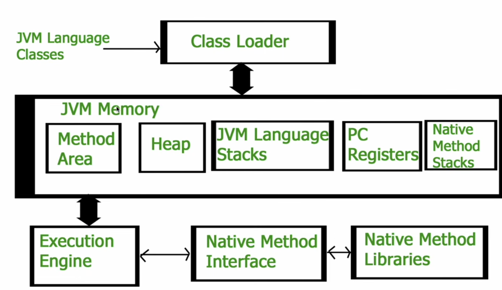
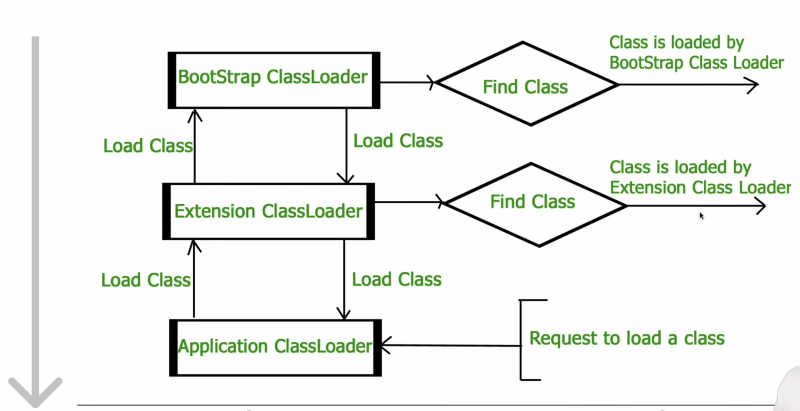
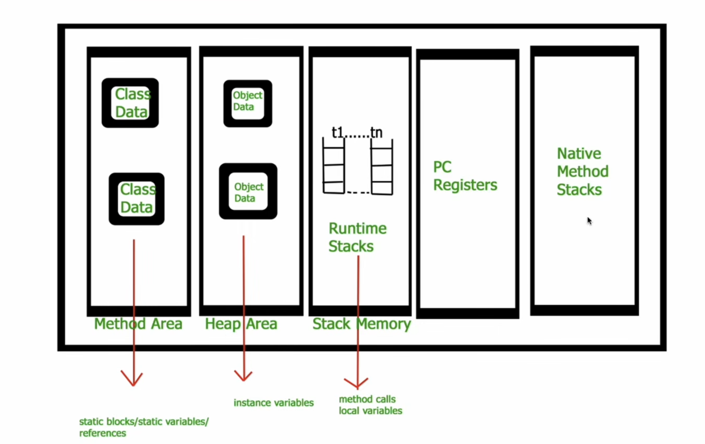

# JVM Architecture

## What is the JVM?

The JVM is the component responsible for running Java applications. It loads and runs the bytecode generated by the Java compiler, abstracting the underlying operating system and hardware.

## Input to JVM

Java Compiler compiles .java files -> .class files will be created -> JVM gets .class files and run it

## Class Loader

### Responsible for 3 activities:

- Loading:
  1. Read .class file
  2. Generate binary data
  3. Save info in method area (see below):
     1. The fully qualified name of the loaded class and its immediate parent class.
     2. Whether the ".class" is related to Class or Interface or Enum.
     3. Modifier, Variables and Method information etc.
- Linking:
  1. Verification:
     1. Ensures correctness of .class files
     2. Check for format
     3. java.lang.VerifyError if verification fails
  2. Preparation:
     1. Allocates memory for static members
     2. Initialize memory to default values
  3. Resolution:
     1. Transform symbolic references into direct references (ie: an object User user = new User() pointing out a memory address)
- Initialization
  1. Static variables are assigned with values
  2. Executed from top to bottom

### Three Class Loaders

- Bootstrap class loader:
  1. Load classes from bootstrap path (ie: "JAVA_HOME/jre/lib")
- Extension class loader:
  1. Child of bootstrap class loader (ie: "JAVA_HOME/jre/lib/ext")
- System/Application class loader:
  1. Child of the extension class loader
  2. Load classes from the application classpath
  3. Environment variable which mapped to java.class.path

  

## JVM Memory

### Method Area

- This is the place where Class level information is stored
- className, parentName, methods, variable info
- Only 1 Method Area per JVM
- Shared resource

### Heap Area

- Info of all object is stored
- One heap area per JVM
- Shared resource

### Stack Area

- One runtime stack for every thread is stored here
- Every block of stack (activation record / stack frame) stores method calls
- Runtime stack will be destroyed after thread is terminated
- Not a shared resource

### PC Registers

- Stores address of current execution instruction of thread
- Each thread have separate PC Registers

### Native method stacks

- Stores native method info
- Separate native stack for every thread

## Execution Engine

- Excutes bytecode
- Classified in 3 parts:
  1. Interpreter:
     1. Interprets bytecode line by line and executes
     2. Disadvantage
     3. If a method is called multiple times, interpretation multiple times 😰
  2. Just in Time Compiler:
     1. Increases efficiency of interpreter
     2. JIT provides direct native code to avoid re-interpretation
  3. Garbage Collector:
     1. Destroys un-referenced objects.

## Java Native Interface (JNI)

- Interfaces interacts with native method libraries

## Native Method Libraries

- Collection of the Native Libraries (C, C++) which are required byt the Execution Engine
