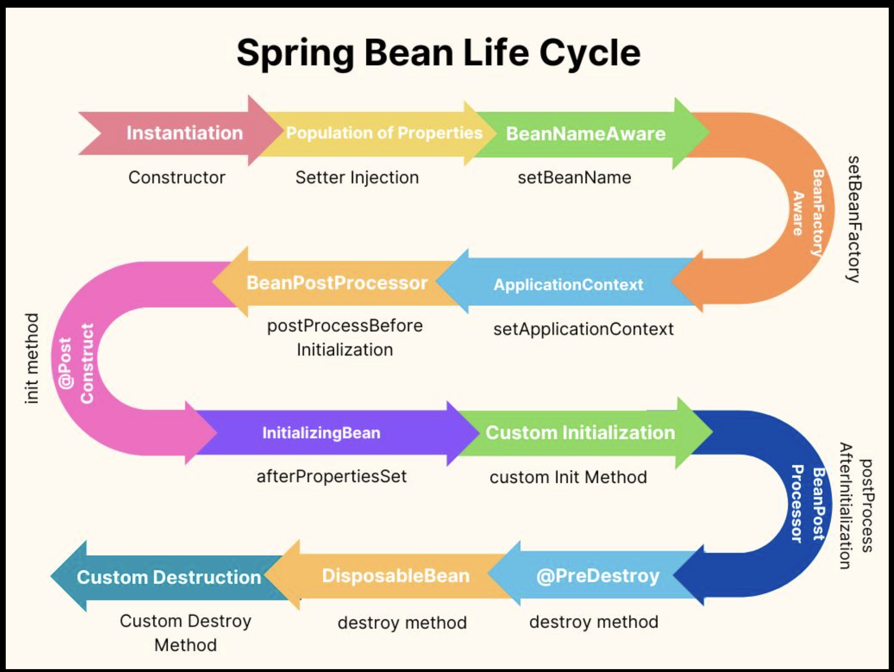

# Spring Bean Lifecycle

## Customizing the Bean Lifecycle

Spring allows you to execute custom logic during the Bean lifecycle, such as:

- Execute code after the Bean has been initialized
- Execute code before the Bean is destroyed



## Initialization Callbacks

### @PostConstruct annotation

The method is executed after all dependencies have been injected.

```
new DatabaseService()
↓
Dependency Injection
↓
@PostConstruct
```

```
@Component
public class DatabaseService {

  @PostConstruct
  public void init() {
    System.out.println("Connecting database...");
  }
}
```

### InitializingBean

InitializingBean is a Spring lifecycle interface. The afterPropertiesSet() method is called after all Bean properties have been set.

```
@Component
public class CacheService implements InitializingBean {

  @Override
  public void afterPropertiesSet(){
    System.out.println("Cache initialized");
  }

}
```

### @PreDestroy annotation

When the ApplicationContext is closed, Spring invokes methods annotated with @PreDestroy before destroying the Bean.

Typical use cases include:

- Closing database connections
- Releasing resources
- Stopping background threads

```
@Component
public class ConnectionPool {

  @PreDestroy
  public void shutdown() {
    System.out.println("Closing connections");
  }
}
```

### DisposableBean

DisposableBean is a Spring lifecycle interface. The destroy() method is invoked before the Bean is removed from the container.

```
@Component
public class Worker implements DisposableBean {

  @Override
  public void destroy(){
    System.out.println("Stop worker threads.");
  }

}
```

> **Best Practice**
>
> In most Spring Boot applications, prefer using `@PostConstruct` and `@PreDestroy` over implementing `InitializingBean` and `DisposableBean`, as annotations keep your classes less coupled to the Spring Framework.
